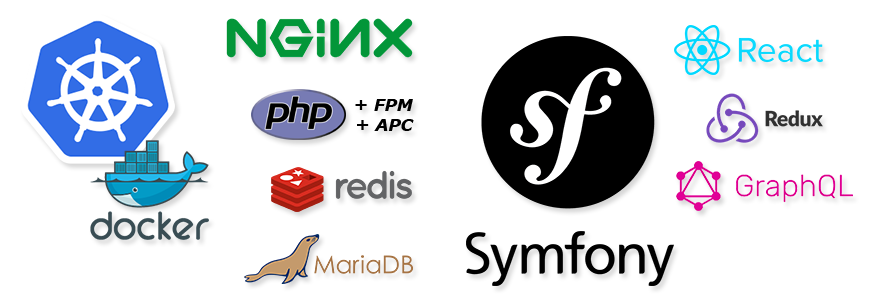

<h3 align="center">K8sSymfonyReact</h3>
<br />
<p align="center">
  <a href="#">
    
  </a>
</p>

<p align="center">
  K8sSymfonyReact is ready-to-go boilerplate for a scalable Symfony application with a React frontend.<br />
  <br />
  <a href="./LICENSE"></a>
  
</p>

## Prerequisites
The following tools should be available from your command line:
- [Node.js](https://nodejs.org)
- [Yarn](https://yarnpkg.com)
- [Composer](https://getcomposer.org)
- [Docker](https://www.docker.com/get-docker) and [Compose](https://docs.docker.com/compose/)

## Start
Build and run your application, watching container logs:
```bash
docker-compose up --build
```

Build your assets:
```bash
yarn dev-server
```

## Console
```bash
docker-compose exec php bin/console
```

## Lint
Check code styles using linters:
```bash
yarn lint
```

## Test
Test your application:
```bash
yarn test
```

## Build
Build your application for production:
```bash
yarn build
```

## Push
Push the build to your container registry:
```bash
yarn push
```
_Requires docker to be configured for the container registry ([example for Google Cloud](https://github.com/webbertakken/PracticalNotes/blob/master/Cloud/Google/K8sContainerRegistry.md))._

_The recommended way to do this is to authenticate a builder-system to the
container-registry of your cloud project._

## Release
Perform a rolling update to your production or staging,
depending on current kubectl context (cluster and namespace):
```bash
yarn release
```
_Requires a running Kubernetes cluster having the projects
[infrastructure](.k8s/infrastructure/README.md) set up._

_Additionally you need to have a context configured for kubectl,
that reflects the cluster and the desired namespace for this build._

## Troubleshooting
When experiencing unexpected problems, refer to the
[troubleshooting](development.md#troubleshooting)
section to update the requirements.

If that doesn't work; please create an issue.
